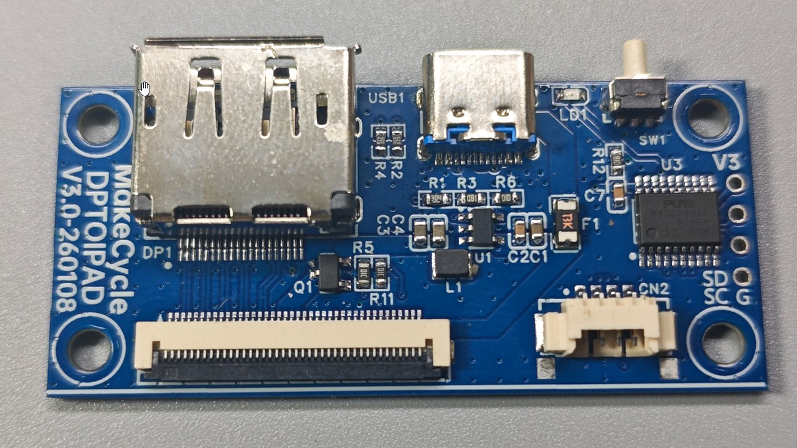

# dptoipad-lite: DP to iPad Universal Mainboard (Lite Version)

The **dptoipad-lite** is a universal mainboard designed to convert DisplayPort (DP) input into a 40-pin FPC output. It utilizes 0603 SMD components, making it relatively easy to solder and ideal for DIY enthusiasts.

To check which models are supported by this mainboard, please refer to the specific device's documentation, where compatible display mainboard models are listed.

To drive a display, the **dptoipad-lite** must be used in conjunction with an FPC ribbon cable and a model-specific display adapter. 

### 🛠️ Setup Example (iPad 3 / A1416)
1.  **Mainboard**: Use the **dptoipad-lite** mainboard.
2.  **Cable**: Requires a standard **40-pin FPC Ribbon Cable**.
3.  **Display Adapter**: Use the **iPad 3 Display Adapter** found within the **iPad 3 device folder** in the iPad series adapter collection.

---

## Key Features
1. **Signal Conversion**: Converts DisplayPort input to a 40-pin FPC interface.
2. **Integrated MCU**: Manages single-button operation, LED status indication, PWM backlight control, and **Reverse Connection Protection**.
3. **Touch Support**: Provides a 4-pin connector for touchscreen integration.

---

## ⚠️ Important: Reverse Connection Protection
iPad-series connectors are often symmetrical and can be physically plugged in backwards. **Installing the connector in the wrong orientation will likely burn out the screen.** To prevent this, I implemented the following protection logic:

1. **Detection Phase**: Upon power-up, the MCU first enables the screen's logic power and waits for the **HPD (Hot Plug Detect)** signal.
2. **Safe Mode**: Only if a normal **High** HPD signal is detected will the MCU pass the HPD signal to the DP source and enable the **BL_EN** (Backlight Enable) signal. This allows the MOS on the display adapter to output 5V to the backlight boost chip, providing the ~20V required for the LEDs.
3. **Fault Protection**: If the HPD signal remains **Low**, the MCU assumes a connection fault. It immediately cuts screen power, disables **BL_EN**, and triggers a fast-flashing LED alert. Without the 5V supply, the boost chip remains inactive, saving your screen from damage.

**I strongly recommend retaining this protection logic if you reference or fork this project.**

---

## Button Operation & UI
* **Short Press**: System Power ON / OFF.
* **Long Press (Brightness)**: 
    * Adjusts brightness from 100% to 0% (or 0% to 100%). The LED flashes when reaching the minimum or maximum limit.
    * Release and long-press again to reverse the adjustment direction.
* **Auto-Save**: After adjusting brightness, if the new value differs from the previous one, the MCU will wait a moment and then save the value to memory (confirmed by an LED flash).
* **Stealth Mode (LED Toggle)**: If you prefer the LED to stay off during operation: hold the button **before** plugging in the power. The MCU will disable the "Always-On" LED status (though error/status flashes will remain active).

---

## Additional Notes
1. **Compatibility**: The dptoipad mainboard + adapter system can also drive other eDP screens without built-in backlights (e.g., Surface Pro 4 screens).
2. **Coupling Capacitors**: iPad-series screens have built-in coupling capacitors for the DP link, so they are **not** included on the dptoipad mainboard. If you use this board for other eDP screens, ensure you place the coupling capacitors on your specific adapter board.

---

## 📥 Project Downloads

Click the link below to download the complete production files for **dptoipad-lite-v1.0**:

[Download dptoipad-lite-v1.0.rar (RAR)](https://github.com/MakeCycle-lab/makecycle-lab/releases/download/Release-Main-Boards/dptoipad-lite-v1.0.rar)

---

## 📺 Video Guide

Click the link below to watch the application of the **dptoipad-lite** mainboard in the iPad 3 monitor conversion project:

[Watch the Tutorial on YouTube](https://youtu.be/SIrAsRxxnzA?si=k5JAVLB_saVsBVGC)