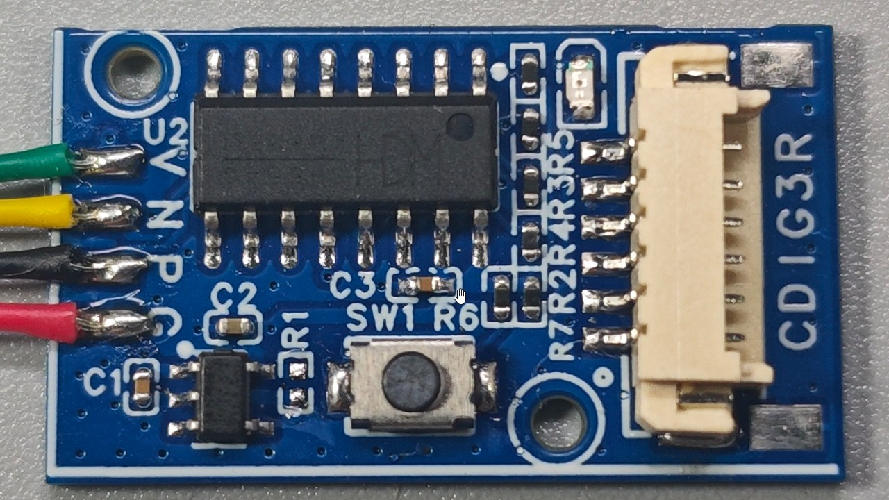
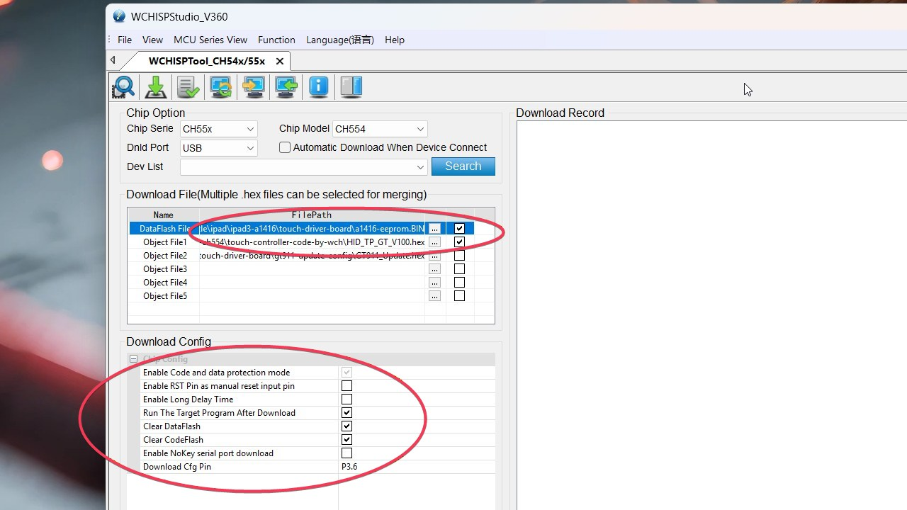

# touch-controller-ch554: USB Touch Controller

The **touch-controller-ch554** is a USB touch controller capable of interfacing with common touch driver ICs (such as Goodix, FocalTech, etc.) to create a functional USB touchscreen. It must be paired with a device-specific touch adapter to operate.

### Background & Credits
This project originates from the official WCH forum: [https://www.wch.cn/bbs/thread-70716-1.html](https://www.wch.cn/bbs/thread-70716-1.html). 

I have archived the original files in this repository to ensure availability. Please note:
* **Firmware**: Since the original source code is based on the Keil C51 environment (which lacks a free version), I have used the provided **.hex** firmware directly from the archive.
* **Hardware**: I have reconstructed the PCB for this project.

---

### 🔍 Firmware & Driving Logic

The **CH554 Touch Controller** acts as an **I2C-to-USB bridge**. However, many vintage touchscreens (like the iPad 3) are raw touch matrices without an onboard I2C or SPI driver IC. Therefore, the CH554 cannot drive these screens directly.

To bridge this gap, specific device folders (e.g., iPad 3) include a **Touch Adapter** equipped with a **GT9110** (or similar) driver chip. This chip converts the raw matrix input into an I2C signal, which the CH554 then translates into a standard USB HID Touch device.

### 🛠️ Usage Example: iPad 3 USB Touchscreen Setup

To implement a USB touchscreen for an iPad 3, the following combination is required:

1.  **USB Touch Controller**: Use the **touch-controller-ch554** mainboard.
2.  **Touchscreen Adapter**: Locate the **iPad Series Adapters** directory, then find the **iPad 3 Adapter** collection. Use the touch adapter found within that project.

---

### 💾 Firmware Flashing Guide

To implement a universal CH554 touch controller, you must flash the official WCH firmware along with the specific **EEPROM file** for the device you intend to drive.

#### 1. Preparation
* **Software**: Download and install the **WCHISPStudio** flashing tool and its required drivers.
* **Main Firmware**: Locate `HID_TP_GT_V100.hex` inside the **touch-controller-ch554-3rd.rar** (available in the Downloads section below).
* **EEPROM Data**: Locate the specific `.bin` or `.hex` EEPROM file within the **target device's RAR package** (Note: Some devices may not require a separate EEPROM file).

#### 2. Flashing Procedure
1.  **Enter Download Mode**: Press and hold the **Flash Button** on the CH554 board while connecting it to your PC via USB. The software should detect the device.
2.  **Load Files in WCHISPStudio**:
    * **Data Flash File**: Select your device-specific EEPROM file and ensure the checkbox is ticked.
    * **Object File 1**: Select `HID_TP_GT_V100.hex` and ensure the checkbox is ticked.
3.  **Config Check**: Verify all settings match the screenshot below:

4.  **Execute**: Click **Download**. Once completed, your computer will recognize the board as a standard **USB HID Touchscreen** device.

---

## 📥 Project Downloads

Click the link below to download the firmware and production files for the CH554 controller:

[Download touch-controller-ch554-3rd-v1.0.rar (RAR)](https://github.com/MakeCycle-lab/makecycle-lab/releases/download/universal-mainboards/touch-controller-ch554-v1.0.rar)

---

## 📺 Video Guide

Click the link below to watch the application of the CH554 controller in the iPad 3 monitor conversion project:

[Watch the Tutorial on YouTube](https://youtu.be/SIrAsRxxnzA?si=k5JAVLB_saVsBVGC)

