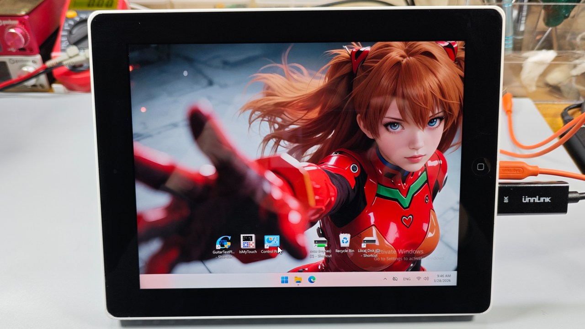
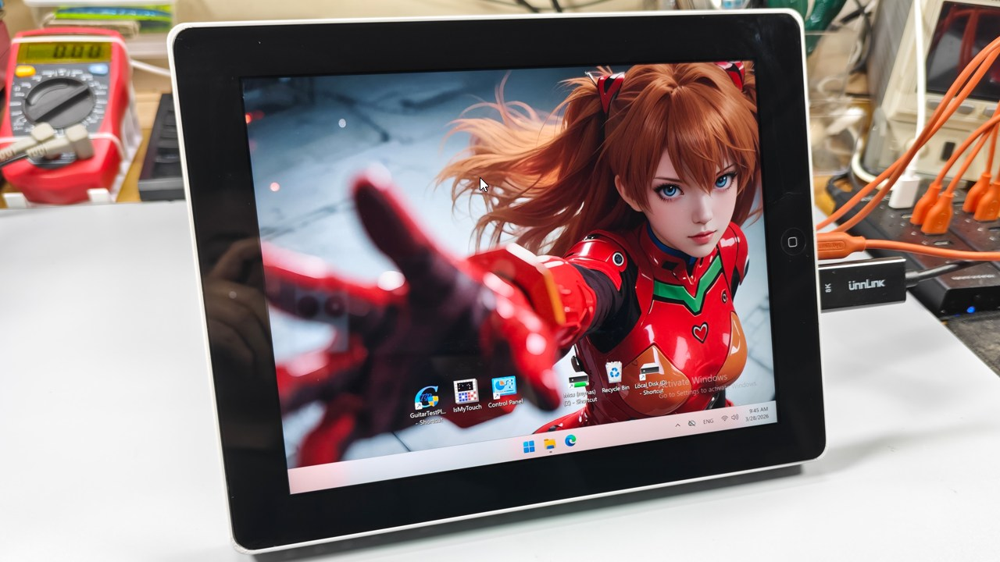
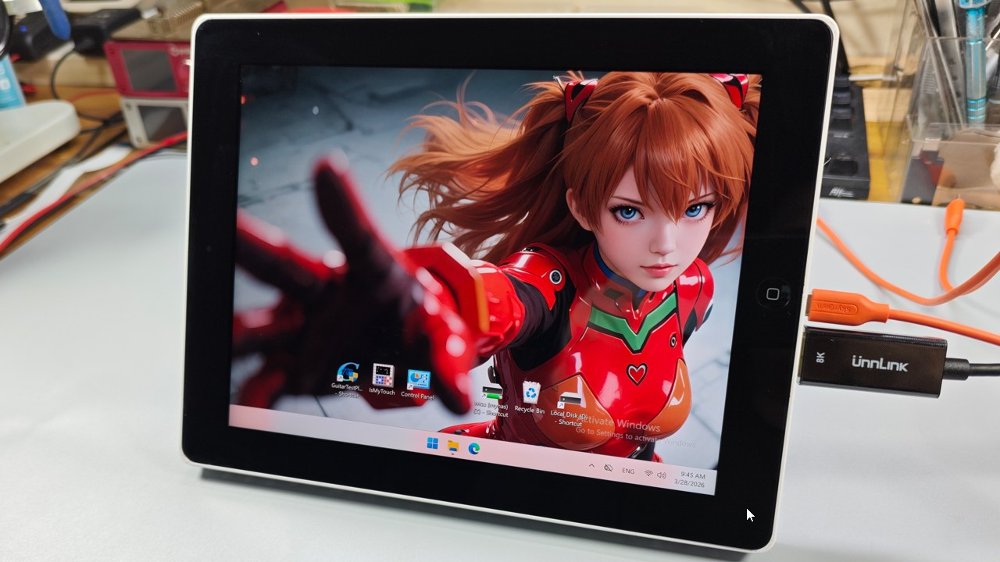
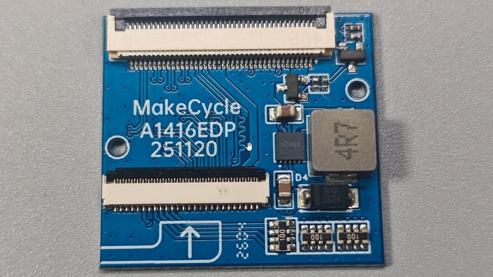
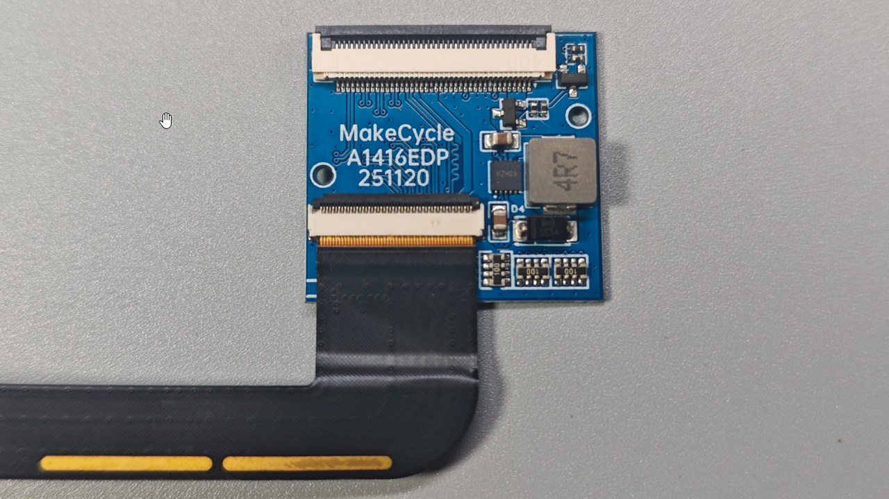
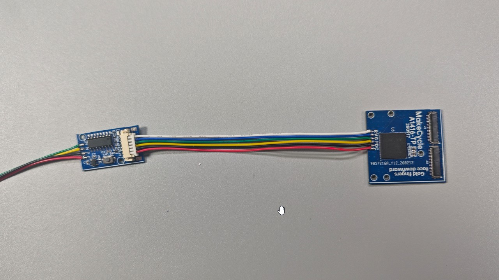

# a1416-ipad3-adapters: iPad 3/4 Display & Touch Solutions

This directory contains the hardware to adapt iPad 3/4 screens for DIY monitor projects. 

## 🖼️ Build Showcase

**Compatible Models:**
* iPad 3 (A1416, and cellular versions)
* iPad 4 (A1458, and cellular versions)

---

## 📺 Part 1: Display Adapter
**a1416-ipad3-display-adapter**

This adapter converts the iPad 3/4 screen interface to a 40-pin FPC connector. It features integrated power control and a backlight boost circuit.

### Required Mainboards
Must be paired with a compatible mainboard, such as:
1. **edp-00-dptoipad-lite** (Find details in the `/00-display-mainboards-and-sub-boards` directory).

### ⚠️ Installation Warning: Connector Orientation
The screen must be installed in the direction shown below. **Reversing the connector orientation may result in permanent damage to the display.**

---

## 👆 Part 2: Touch Adapter (I2C)
**a1416-ipad3-touch-adapter**

This adapter converts the iPad 3/4 touchscreen matrix into a standard 6-pin I2C output, based on the **Goodix GT9110** chip.

### Required Touch Controllers
Must be paired with a compatible touch controller, such as:
1. **i2c-00-touch-controller-ch554-3rd** (Find details in the `/00-touch-controllers` directory).

### 🛠️ Configuration Guide (First-Time Setup)
The **GT9110** chip must be initialized before its first use:

1.  **Locate Firmware**: Find `GT911_Update.hex` in the `gt911-update-config` folder.
2.  **Flash the Controller**: Burn this file onto the **i2c-00-touch-controller-ch554-3rd** board.
3.  **Execute Update**: 
    * Power on the system and wait for the MCU to flash the configuration to the GT9110. 
    * Once the **LED stays solid (on)**, the update is complete. 
    * **Immediately disconnect** the controller.
    * **⚠️ Note**: Avoid re-powering the system while the controller is connected to the adapter. This prevents the MCU from re-triggering the update process, which could lead to a **partial/corrupted write** if interrupted.
4.  **Finalize**: The adapter is now ready for I2C use. For USB touch, refer to the CH554 folder for USB firmware.

### Connection Guide

---

## 📦 Technical Assets
Additionally, 3D-printable enclosures and accessory specifications are included in this project. Due to space constraints, they are not detailed here; please refer to the relevant folders within the **RAR** package for more information.

## 📥 Project Downloads

Click the link below to download the resource files for the iPad monitor conversion:

[Download a1416-ipad3-adapters.rar (RAR)](https://github.com/MakeCycle-lab/makecycle-lab/releases/download/downloads/a1416-ipad3-adapters-v1.0.rar)

---

## 📺 Video Guide

Click the link below to watch the detailed step-by-step video of the iPad monitor conversion process:

[Watch the Tutorial on YouTube](https://www.youtube.com/watch?v=YOUR_VIDEO_ID)