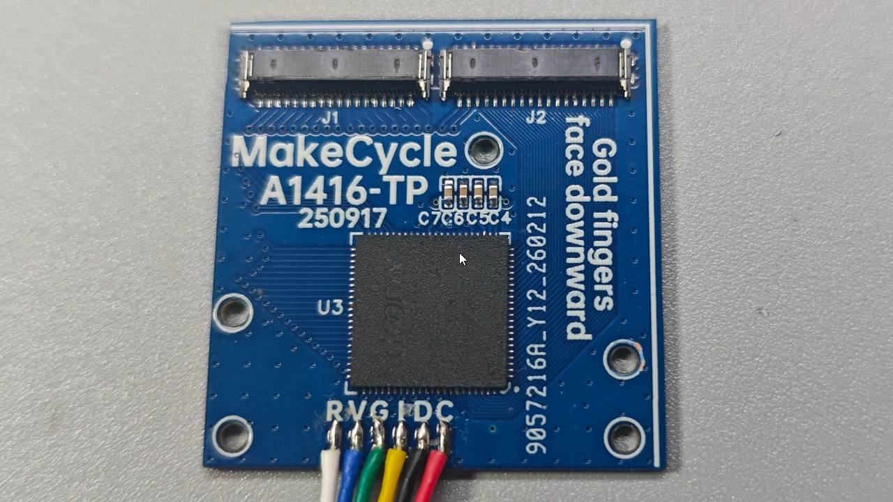
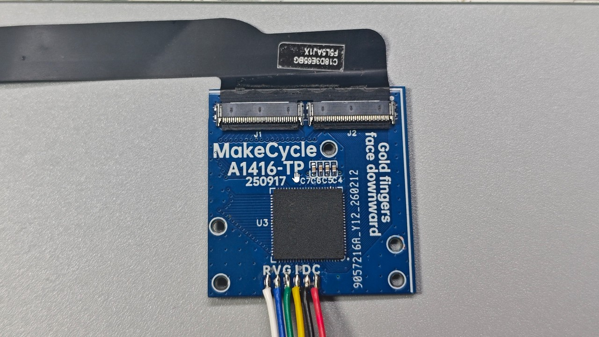

# a1416-ipad3-adapters: iPad 3/4 Display & Touch Solutions

This directory contains the necessary hardware to adapt iPad 3 and iPad 4 screens for DIY monitor projects. 

**Compatible Models:**
* iPad 3 (A1416, and cellular versions)
* iPad 4 (A1458, and cellular versions)

---

## 📺 Part 1: Display Adapter
**a1416-ipad3-display-adapter**

This adapter converts the iPad 3/4 screen interface to a 40-pin FPC connector. It features integrated power control and a backlight boost circuit.

### ⚠️ Installation Warning: Connector Orientation
The screen must be installed in the direction shown below. **Reversing the connector orientation may result in permanent damage to the display.**

### Required Mainboards
Must be paired with a compatible mainboard, such as:
1. **edp-00-dptoipad-lite** (Find details in the `/00-display-mainboards-and-sub-boards` directory).

---

## 👆 Part 2: Touch Adapter (I2C)
**a1416-ipad3-touch-adapter**

This adapter converts the iPad 3/4 touchscreen matrix into a standard 6-pin I2C output, based on the **Goodix GT9110** chip.

### Connection Guide
The image below demonstrates how to connect the touchscreen to the adapter:

### USB Touch Integration
To enable USB control, use an I2C-to-USB controller:
1. **i2c-00-touch-controller-ch554-3rd** (Find details in the `/01-generic-touch-controller-boards` directory).

---

## 📥 Download Production Files
Click the link below to download the complete production package for both Display and Touch adapters:

[Download a1416-ipad3-adapters.zip (ZIP)](你的Release下载直链)

*Note: This ZIP contains assets for both the display and touch adapter boards.*